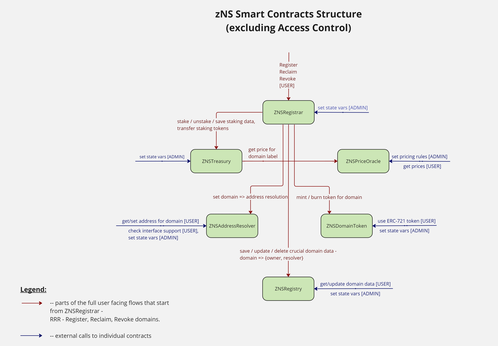
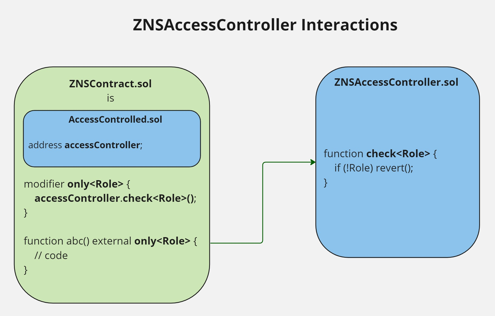

# System Architecture

## [ZNSAccessController](./contracts/access/ZNSAccessController.md) and [AccessControlled](./contracts/access/AccessControlled.md)

This is the module for access control of the whole ZNS system. Every contract inherits `AccessControlled` abstract contract that implements:

- `accessController` as a state variable to be present in every child
- a getter for accessController
- a setter declaration for `accessController` to make sure every child contract implements it locally
- an event to fire every time `accessController` is changes in state
- `onlyAdmin` and `onlyRegistrar` modifiers since they are used in most child contracts

Upon inheriting the `AccessControlled` every contract is connected to the overall access control of the system through `ZNSAccessController` address that has to be passed at initialization time in order to prevent non-admin accounts from setting crucial values in storage.

`ZNSAccessController` itself inherits `AccessControl` from Open Zeppelin and adds some specific logic to provide ZNS contracts with necessary functions to limit system access to crucial functions.

### Key responsibilities
- Provide a template for every contract in the system on how to add access control to its logic (via `AccessControlled`)
- Make sure important functions are implemented in children so that `accessController` variable can not be lost and can be reset on a live system
- Provide constants for all active roles in the system that will be used in production to validate callers
- Provide functionality to set good role structure for system safety
- Provide functionality to set and remove roles from accounts
- Provide easy role checking functionality that all contracts using this module can access within their logic

## [ZNSRegistry](./contracts/registry/ZNSRegistry.md)

Key storage contract of the system responsible for basic crucial data about every domain/subdomain registered. The below data is mapped to each domain’s hash in `ZNSRegistry.records`.

- `owner` (address) - owner of a domain. This address is necessary for the system to keep track of owners of domains and to provide secure access to domain management functionality. Only domain owner can modify and control a domain. Can be any arbitrary Ethereum address: smart contract, EOA. In cases when subdomain distribution (or other functionality) is being managed by the arbitrary contract, this contract has to be the owner of the parent domain.
- `resolver` (address) - address of a contract responsible for binding each domain name to a content of a certain type (e.g. ethereum address). For more info see “Resolvers” section.

Every domain registered HAS to settle on this contract with its crucial data (above) written into a mapping keyed by domain name hash (bytes32).

`ZNSRegistry` also has a mapping of `operators` in its state to manage operators for each owner. Operator gets access to **ALL** domains of the owner and can perform any operation on them. This is a crucial functionality for the system to be able to provide a way for owners to delegate domain management to other accounts. Operator can **NOT** change the owner of the domain in `ZNSRegistry`.

### Key responsibilities
- Serves as the last step of a domain registration process by saving the domain data in its storage
- Official final reference of an existence of a certain domain - we call `ZNSRegistry` to verify that a new domain being minted has not been minted already
- Is the first step in domain source discovery - we call `ZNSRegistry.getDomainResolver()` to find the Resolver that will tell us what this domain was created for (contract or wallet address, string, metadata hash, etc.). Currently ONLY `ZNSAddressResolver` is implemented, but more resolvers to come in the future for more data types.
- Reference for crucial domain related data (owner, resolver).
- Provide a way to install operators for any owner to allow them access to changing resolvers without the presence of the owner

## [ZNSDomainToken](./contracts/token/ZNSDomainToken.md)

A single token contract (ERC-721) responsible for tokenizing every domain/subdomain in the system, providing standard token functionality (e.g. transfer, mint, burn, etc.) for the ease of domain management along with ZNS specific functionality added on top of ERC-721 ABI.

### Key responsibilities
- Mint a new token every time a domain is registered atomically within the register transaction (i.e. `ZNSRegistrar.registerRootDomain()` -> `ZNSDomainToken.register()`)
- Burn the respective token every time a domain is revoked atomically within the revoke transaction (`ZNSRegistrar.revokeDomain()` -> `ZNSDomainToken.revoke()`)
- Determine and check owner of any given domain token by the tokenId
- Transfer/sell domain token to change the owner of the Token
- Serve as a standard ERC-721 token with all the functionality provided, so the token can be traded and managed by other applications

## Resolvers and [ZNSAddressResolver](./contracts/resolver/ZNSAddressResolver.md)
zNS system is expected to have multiple Resolver contracts, each being responsible for resolutions to their own supported types for domain sources. Zero will deploy a certain amount of them to support data types planned (FUTURE) , but these Resolvers can potentially be developed, deployed and managed by any parent domain owner to provide more data type resolutions for their subdomains.

Resolver is structured to be a simple contract, having a mapping of a domain namehash to the specific source type (e.g. `bytes32 => address` OR `bytes32 => bytes`, etc.). Each Resolver can support one data type at a time or can be a combined one, supporting multiple.

The ONLY resolver currently implemented is `ZNSAddressResolver`. It supports only address data type and has a simple mapping of `bytes32 domainHash => address contentAddress`.

### Key responsibilities
- Provide a straightforward binging of a domain namehash to specific domain source data (e.g. `hash(“cooldomainname”) => 0x1bc5d767ff…`)
- Provide a simple and straightforward resolution from a name to domain source
- Provide the way for any domain owner to change their domain source at any point in time along with simple access control which will not allow anyone else, other than the domain owner, to change this data
- Interface checking logic (ERC-165) to provide easy type checking on supported types for the current Resolver.

## ZNSPricers
zNS system supports using multiple different contracts as "pricers". A Pricer contract is a contract that encompases a certain way/formula
to price the registrations of its subdomains. Every time a new subdomain is minted one of the pricer contracts is used to determine how much
a subdomain buyer needs to pay its parent.

Currently, 2 different pricers are implemented and supported:

## [ZNSCurvePricer](./contracts/price/ZNSCurvePricer.md)
`ZNSCurvePricer` is one of the options a domain owner can use to price their subdomains. It is based on a curve formula that takes the length of the label string and calculates the price based on it.
The curve has 3 main parts:
- the flat beginning, until `baseLength`, where a fixed `maxPrice` is returned;
- a curve part where the price declines the longer the domain label is;
- the flat end, from `maxLength`, where a fixed `minPrice` is returned.

This contract also includes the possibility to set a certain `feePercentage` that will be applied to the calculated price and will be sent to the domain owner.
The `feePercentage` is set by the domain owner and can be changed at any point in time, but will **ONLY** be taken into account if the distribution type of the parent domain is `STAKE`.

Another feature of the contract is the ability to set `precisionMultiplier` that allows a calculated price to be truncated to a certain precision.
The `precisionMultiplier` is set by the domain owner and can be changed at any point in time.

> Zer0 uses `ZNSCurvePricer` as the default pricer for all World domains.

To learn more about the formula, fees and precisions, please refer to the contract documentation - [ZNSCurvePricer](./contracts/price/ZNSCurvePricer.md).

### Key responsibilities
- Provides a deterministic formula for domain name price calculations based on the length of the label string, where a price declines the longer the label is
- Provides a way to set and get a calculated fee value based on the price of the domain and the fee percentage set by the domain owner
- Provides ways to reconfigure pricing and fees on a live system based on the set of variables through their setters

## [ZNSFixedPricer](./contracts/price/ZNSFixedPricer.md)
`ZNSFixedPricer` is another, more straightforward contract a domain owner can use to price their subdomains. It is based on a fixed price that is set by the owner of the parent domain.
If a parent domain is using `ZNSFixedPricer`, the prices returned for subdomains will be fixed and always the same, until the owner changes the price on the contract.

This contract also includes the possibility to set a certain `feePercentage` that will be applied to the calculated price and will be sent to the domain owner.
The `feePercentage` is set by the domain owner and can be changed at any point in time, but will **ONLY** be taken into account if the distribution type of the parent domain is `STAKE`.

### Key responsibilities
- Provides a more straightforward way to set a fixed price that will be used for all subdomains
- Provides a way to set and get a calculated fee value based on the price of the domain and the fee percentage set by the domain owner
- Provides ways to reconfigure pricing and fees on a live system based on the set of variables through their setters

## [ZNSTreasury](./contracts/treasury/ZNSTreasury.md)
This contract is responsible for all payments in the system, regardless of the domain depth and currently supports 2 types of payments:
1. `DIRECT` Payment Type - the most straighforward way where `ZNSTreasury` withdraws funds from the buyer's wallet and sends them to the parent domain owner's `beneficiary`.
2. `STAKE` Payment Type - here the buyer is required to stake the parent's `price` taken from one of the Pricer contracts onto `ZNSTreasury` contract itself.
In this case, a parent is allowed to set a certain `feePercentage` that will be applied to the calculated price and will be sent to the domain owner,
and the payment will also include Zer0's `protocolFee` that is taken on top of all of the above. The `STAKE` payment can be refunded back upon domain revocation
Minus all the fees. Treasury itself performs the actual stake transfers and stores their amounts along with the token address used,
mapped by `domainHash`. These amounts are used to unstake upon domain revocation later.

It also moves fees to `zeroVault` address specified by the zNS Admin.

`ZNSTreasury`, besides stake data, also stores the `PaymentConfigs` for each domain, set by the domain owner, which is a struct that contains the following data:
- `token` - the token to be used for payments
- `beneficiary` - the address that will receive the funds upon domain registration, if `STAKE` is used as `paymentType` on `ZNSSubRegistrar`
the `beneficiary` will **ONLY** receive the `stakeFee` set by the domain owner, if `DIRECT` is used, the `beneficiary` will receive the whole `price`

The above configs are used to determine how to charge the buyer and where to send funds.

### Key responsibilities
- Perform stake transfers based on the prices and fees acquired from the pricer contract as a part of the register transaction
- Perform stake withdrawals for users who are removing their domains from zNS as a part of the revoke transaction
- Perform direct transfers of price and all fees for registration
- Store staked amount and token used in state, tied to the domain hash and not a specific owner to be more adaptable to owner changes without the need to perform extra logic

## [ZNSRootRegistrar](./contracts/registrar/ZNSRootRegistrar.md)
This contract is the entry point for 3 main operations:
1. Registering a new **Root** Domain
2. Reclaiming a Domain of any level
3. Revoking a Domain of any level

`ZNSRootRegistrar` is connected to all other contracts and combines multiple operations into atomic transactions,
routes the logic inside zNS to achieve proper results for domain operations. It also ensures proper sequences in which operations
should be performed.

`ZNSRegistrar` is the only contract in the system that has a proper ROLE assigned to it in `ZNSAccessController` to use it
as a way to protect other contracts to be called by any other address, which protects the data in the system and ensures proper operation execution.
Many other contract functions have `onlyRegistrar()` modifiers which make sure that the caller is a contract with `REGISTRAR_ROLE`.

### Key responsibilities
- Store all system crucial modules in state to be able to call required contracts for any flow.
- Provide the main function for registering Root Domains, make sure that operations, especially ones using other contracts are performed properly and in proper sequence. Combine logic of other contracts in one atomic transaction. Check name existence, take the stake from the user, mint a domain token, set the data in `ZNSRegistry`.
- Provide the main function for reclaiming full domain ownership for owners of the specific Domain Token. Ensure that ONLY the owner of the actual token (tokenId) can do this, call `ZNSRegistry` to update the owner in records.
- Provide the main function for revoking domains. Make sure that the only address allowed to do that is both: owner of the Name and owner of the Token. Call `ZNSRegistry` to delete record, call `ZNSDomainToken` to burn the token, call `ZNSTreasury` to unstake (if needed).

## [ZNSSubRegistrar](./contracts/registrar/ZNSSubRegistrar.md)
Contract responsible for the registration of subdomains and distribution configs for domains of all levels that are used to set and determine
how subdomains of any domain will be distributed.

This contract is only connected to `ZNSRegistry` and `ZNSRootRegistrar` and uses its common functions to finalize subdomain registration. It stores `DistributionConfig`s for each domain in state, mapped by domain hash.
It also manages Mintlists for each domain, where the owner of the domain can add and remove addresses that will be allowed to mint subdomains of this domain.

This contract is also assigned `REGISTRAR_ROLE` at deploy time to be able to call other contracts with `onlyRegistrar()` modifiers.
All the state variables on this contract are able to be reset by either the domain owner (for domain related setters) or Zer0 Admin for the setters of system variables.

For more information on Distribution Configs and Mintlists, please refer to the contract docs [ZNSSubRegistrar](./contracts/registrar/ZNSSubRegistrar.md).

### Key responsibilities
- Provide a way to register subdomains of any level.
- Provide a way to set and get Distribution Rules (configs) for any domain.
- Provide a way to set and get Mintlists for any domain.
- Work together with `ZNSRootRegistrar` to finalize registration of subdomains.