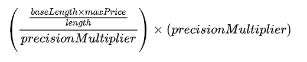

# Pricing

### Pricing Modules 

At present, there are two contracts deployed as zNS pricers, managing all domains:

* **Curved Pricing**: Calculates the price of a domain based on the length of that domain's label
* **Fixed Pricing**: Provides a fixed price for every subdomain regardless of the length

The minimum requirements for a compatible price contract are located in `IZNSPricer.sol` if users are inclined to create them themselves. Users wishing to create their own pricing module must only inherit from this contract, otherwise it will be incompatible with the system.

### Configuration

Both available pricers require some form of configuration to be set.

#### Fixed Pricer

The fixed price contract is simple in that it only requires two configuration values.

* **Price**: The given price of a domain relative to the amount of precision specified by the `paymentToken`
  * e.g. If the price is set to 1000 tokens, the resolved number of tokens to transfer in payment will be different for a specified payment token that has `10^18` decimals of precision, versus one that was `10^5` decimals
* **Stake fee percentage**: The registration fee for STAKE type payments in percentage as basis points (parts per 10,000) so the 2% value would be represented as 200. This value can be 0 and is not required to be set. For example, this can be added when using FixedPricing along with StakePayment, so that the owner can get paid on top of the stake held on StakePayment contract. If STAKE payment type is **not** used, the fee will not be charged even if set.

#### Curve Pricer

For the curved pricing contract it's more complex.

* `maxPrice` - maximum price for a domain with length <= `baseLength`
* `minPrice` - minimum price for a domain with length > `maxLength`
* `maxLength` - maximum length of a domain name. If the name is longer than this value we return the `minPrice`
* `baseLength` - base length of a domain name. If the name is less than or equal to this value we return the `maxPrice`
*   `precisionMultiplier` - precision multiplier of the price. This multiplier should be picked based on the number of token decimals to calculate properly.

    It's an optional parameter in `ZNSCurvePricer` that can be set by the domain owner/operator to truncate the unnecessary decimals off the price. If precision for calculation is not needed for a domain owner, `precisionMultiplier` should be set to `1`, that will avoid truncation altogether.

    If truncation is needed `precisionMultiplier` should be calculated as:\
    `10 ^ (tokenDecimals - requiredPrecision)`. e.g. if the token has 8 decimals and you want to only leave 2 decimals, the `precisionMultiplier` would be `10 ^ (8 - 2) = 10 ^ 6`. This would result in a price value of 1.23456789 TOKEN to be returned as 1.23 TOKEN.
* `feePercentage` - the registration fee value in percentage as basis points (parts per 10,000) so the 2% value would be represented as 200


Please note:

* `precisionMultiplier` is **NOT** a direct value of precision you want, but a result of subtraction of precision value from the value of decimals of the token chosen as a power of `10`!
* If truncation is not needed, `precisionMultiplier` should be set to `1`. It will be set to `1` as a default value for all newly minted domains, UNLESS the domain registrant specifically sets it to the value they choose.
* The `precisionMultiplier` can **NOT** be set to `0`, because it would produce a price of `0` disregarding the rest of the config!
* The `precisionMultiplier` can **NOT** be set to a value greater than `10 ^ 18`!
* The `precisionMultiplier` can, but should **NOT** be set to a value higher than `10 ^ decimals` of the token used for payments and pricing. **Doing this would result in an incorrect price calculation followed by the incorrect payment.**
* The correct return from `getPrice()` will be dependent on the domain owner/operator to set the `precisionMultiplier` correctly or leave it as a default `1`.


As an example, consider when `baseLength == 3` and `maxLength == 30.`Domains with length 1, 2, or 3 will return the `maxPrice`. Domains with length 31 or beyond will return the `minPrice`  and domains with lengths 4 to 30 will be priced according to the specified formula below.

Mathematically the division and following multiplication of the same number will cancel out, however this method takes advantage of the way Solidity stores numbers. Note that `x * (y / m)` is not always the same as `(y / m) * x` in Solidity. Because we do the division first, there is a forced truncation of the actual number, then the multiplication will bring it back to its original values, but with zeros beyond the specified digits of precision.

The curve function uses the following formula:

<figure><figcaption>
The curved pricing function
</figcaption></figure>
